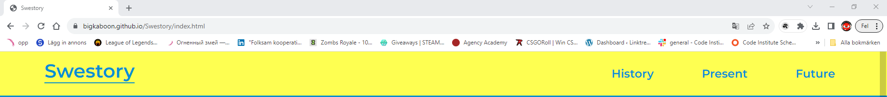
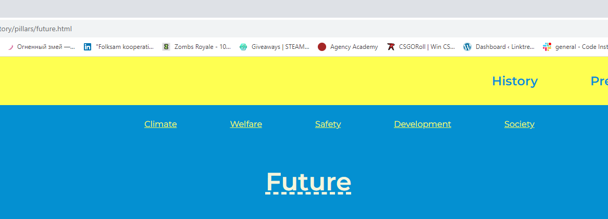
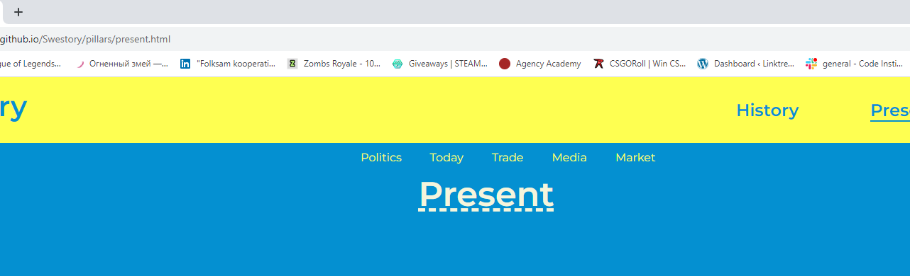
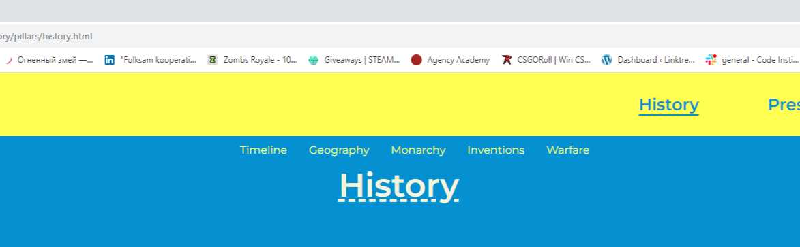
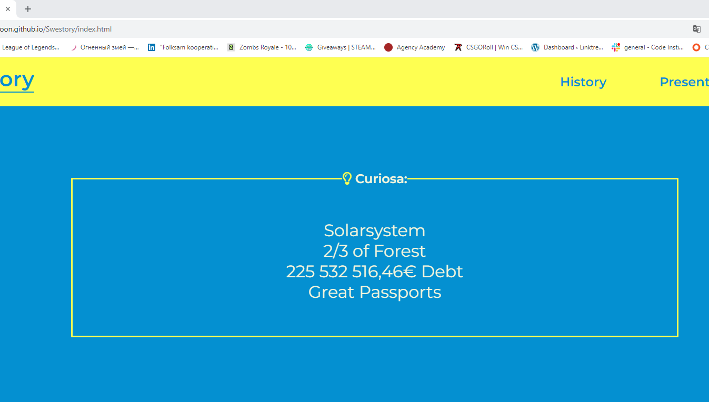
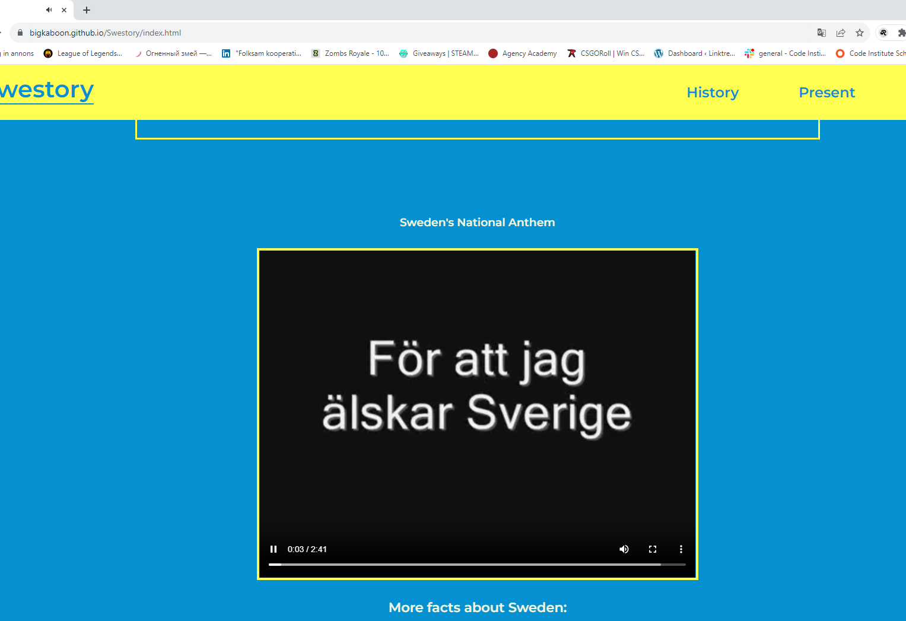
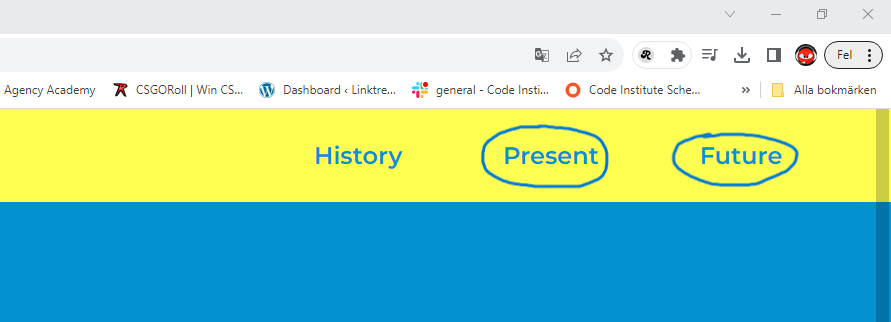
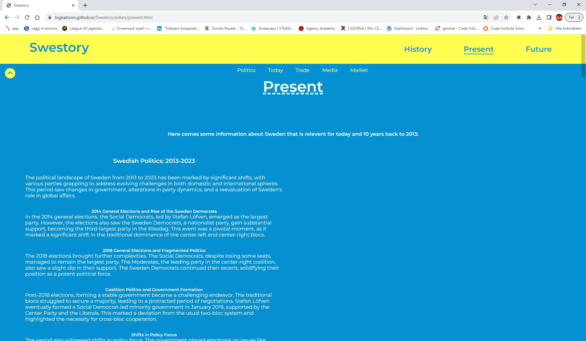
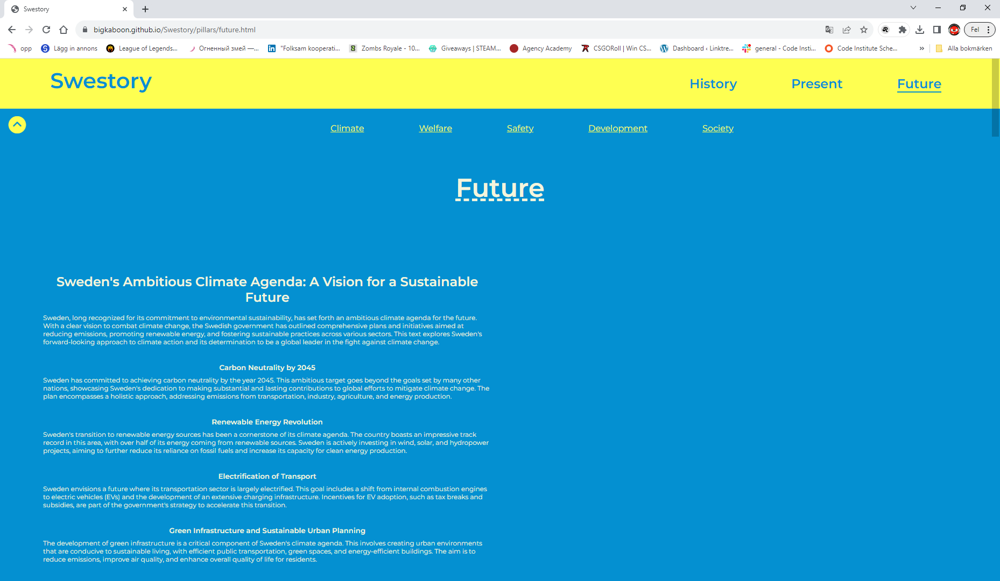
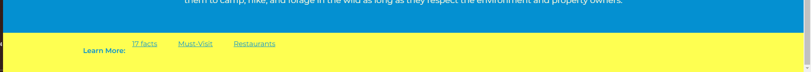

# Swestory
Are you a none-swede, just moved to Sweden, Swedish citizen or just a fellow person who wants to learn more about the country, then you should visit [Swestory.com](https://bigkaboon.github.io/Swestory/). This website is made to especially provide information about Swedish history, how Sweden is today and the Swedish visions for the future.

In addition to that it even provides you with fun and interesting facts regarding the country. Do not miss this site out if you for instance need to learn about swedish- politics, war history, media or maybe how Sweden handles climate changes. This site is meant for learners who is in need of a reliable source of information about Sweden. It is easy to navigate around the site with an appealing layout that is relatively easy to learn witch facilitates information searching for all the young learners out there but also provides a comfortable user experience.
## Features:
- **Navigation bars and buttons**

    - I have navigation bars not just to navigate around the different pages but also to make it easier to navigate the information provided, in addition to that I created a button in order for the users to as easy as possible get back to the top of the page again. The purpose of this features is to ease the searching process since the people who would use the website would look for information about Sweden.

- **Curiosa**
  - I created the Curiosa feature in order to provide the users with knowledge of Sweden that could be nice to have but not as useful maybe as the rest of the page. My goal with this is to create a less overwhelming environment to find the information needed by the users.

- **Playable video**
  - I added a playable video of the national anthem of Sweden since I thought it would be relevant for the home page that already provides plenty of “not as important” information in comprehension to the rest of the site. I wanted to create a relatively simple atmosphere once the user first arrive to the site because too much information could be overwhelming(The same purpose as the Curiosa).

- **+ Present and Future**
  - From the beginning the goal was to create a history website, instead of creating a great gallery of information about the Swedish history only, I also created the “Present” and “Future” page that allows users to learn more than “just” the history. In addition to that this features attracts users who is looking for information about those topics witch creates more traffic to the site.

- **Footer**
  - In the footer I have provided links related to the page the users is on in case they would like to learn more, the purpose of this is to still be useful to the users in case the information provided on the page is not enough.

## Features Left To Implement:

- **Timeline**
  - I wanted to include a timeline because it could impart a clear view of Swedish history if years with some short and concise information about the happenings were implemented.

## Testing:
- **Links/navigation**
  - I have teset all the links to make sure they go the right place and works, the navigation is all working as it is supposed to and makes it easier to navigate around the website.
  
- **Images and videos**
  - I have, on different screen-sizes (My phone and computer) tried looking at the images and videos multiple times, I sent the deployed version to friends and family in order to make sure this features work.
- **Responsiveness**
  - When it comes to repsponsivness I have tested it gradually all the time throughout the process, I have used the media query’s 768px, 992px as in the go through project except for the 1200 px. The site is fully tested with thes measurements and tested in detail. To test this I used the google chrome dev-tool and used Galaxy fold, Ipad mini and my own desktop to relate too. This caused some problems once I visited the deployed version on my phone (Iphone 12) witch is wider than galaxy fold yet narrower than the ipad mini, this resulted in some of the nav-bars being displaced since I for some reason could not center it with “align center”- rule. Instead I used margin measurements. Fortunately I could use the “align center” on the rest of the elements who needed it so except for this detail the site is fully responsive.

## Validator Testing:
 - **HTML** - Passed with no Errors or warnings.
- **CSS**  - Passed with no Errors or warnings.
  
## Unfixed bugs:

- As mentioned earlier in the testing part one unfixed bug is that some nav-bars is not fully centered once visiting on a screen wider than galaxy fold(280px) yet narrower than 768px since I used measurements for margin instead of “align center”. The reason for this is that I was not able to use that rule for a reason I couldnt figure out, This forced me to solve the centering with margin measurements instead since I had to move foreward in process and it took to much time to figure it out, Since it is a 100% responsive to the width’s of 280px-768px-992px I left it in the meantime to fix it if there was time.
- The timeline is not finished yet aswell as I prioritized everything else in order to still have a useful website relative to my targeted group of users.
  
## Deployment
- I deployed the site on GitHub with theese steps:
- I found my way to settings in my Github repository
- I then selected Master Branch in the source drop-down menu
- Lastly I clicked 'save' in order to deploy the site
  
## Credits:
### Content

- Text - geography - on history page - [Source](https://www.goway.com/travel-information/europe/sweden/geography-and-maps/)
- Text - monarch - on history page - [Source](https://www.kungahuset.se/english/the-monarchy-of-sweden)
- Text - inventions - on history page - [Source](https://sweden.se/work-business/business-in-sweden/10-swedish-innovations)
- The rest of the text/information I used on the page is generated by [ChatGPT](https://chat.openai.com/)
  ### A list of youtube videos I found helpful:
- [Link 1](https://www.youtube.com/watch?v=04_8QvV0Sew&t=172s)
- [Link 2](https://www.youtube.com/watch?v=K74l26pE4YA)
- [Link 3](https://www.youtube.com/watch?v=wRNinF7YQqQ&t=160s)

### Media

- [National Anthem - home page](https://www.youtube.com/watch?v=eaIUE4u4JWc)

#### Curiosa Images (All images found on google with Creative Commons License)
- [Portrait of Kim il-sung](https://snl.no/Kim_Il_Sung)
- [Globe](https://commons.wikimedia.org/wiki/File:Globen_or_Ericsson_Globe_%283387500619%29.jpg )
- [North Korea flag](https://www.publicdomainpictures.net/pictures/250000/nahled/north-korea-flag.jpg)
- [Forest image](https://i1.pickpik.com/photos/570/487/709/stone-forest-autumn-nature-preview.jpg)
- [Passport image](https://upload.wikimedia.org/wikipedia/commons/0/08/Sweden_passport.jpg)
